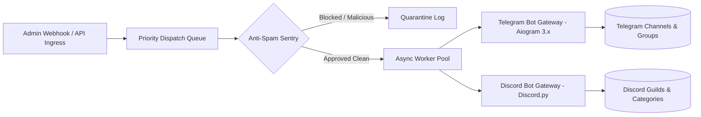

# Nexus Bot Command | Multi-Channel Automation & Dispatch Engine

> **Internal Enterprise System**  
> Commissioned & deployed for **Nexus Operations Group Inc.**  
> **Live Web Portal:** [https://rika812.github.io/nexus-command/](https://rika812.github.io/nexus-command/)

---

## System Overview

**Nexus Bot Command** is a high-throughput, unified orchestration platform built to synchronize automated notifications, emergency security broadcasts, and interactive customer service workflows across multiple chat ecosystems (Telegram and Discord).

### Key Architecture



---

## Core Capabilities

1. **Dual-Channel Dispatching**
   - Simultaneous or targeted dispatching across Telegram bots and Discord application webhooks with sub-60ms delivery latency.

2. **Priority-Tiered Routing**
   - Handles `INFO`, `WARNING`, and `URGENT` broadcast priorities with dedicated rate-limiting buckets to prevent rate-limit throttling by platform APIs.

3. **Anti-Spam & Phishing Sentry**
   - Regex-powered real-time heuristic filter inspecting outbound payloads and user interactions for unauthorized invite links, phishing domains, and token leaks.

4. **Real-time Telemetry & Health Monitoring**
   - Live socket connectivity metrics, channel latency benchmarks, and rolling activity stream.

---

## Project Structure

```text
nexus-command/
├── index.html             # Enterprise real-time monitoring & broadcast dashboard
├── bot_orchestrator.py    # Asynchronous dual-channel dispatcher and sentry engine
├── requirements.txt       # Python dependencies
└── README.md              # Infrastructure and deployment documentation
```

---

## Quickstart & Simulation

### 1. Prerequisites
- Python 3.10+ installed
- Virtual environment recommended

### 2. Installation
```bash
git clone https://github.com/rika812/nexus-command.git
cd nexus-command
pip install -r requirements.txt
```

### 3. Run Gateway Simulator
```bash
python bot_orchestrator.py
```

---

## Production Security & Compliance Notice

This repository contains client-ordered operational infrastructure. Sensitive production API tokens, private guild keys, and proprietary webhook URLs are isolated via environment variables and are excluded from public version control.

*Authorized personnel only. (c) 2026 Nexus Operations Group Inc.*
